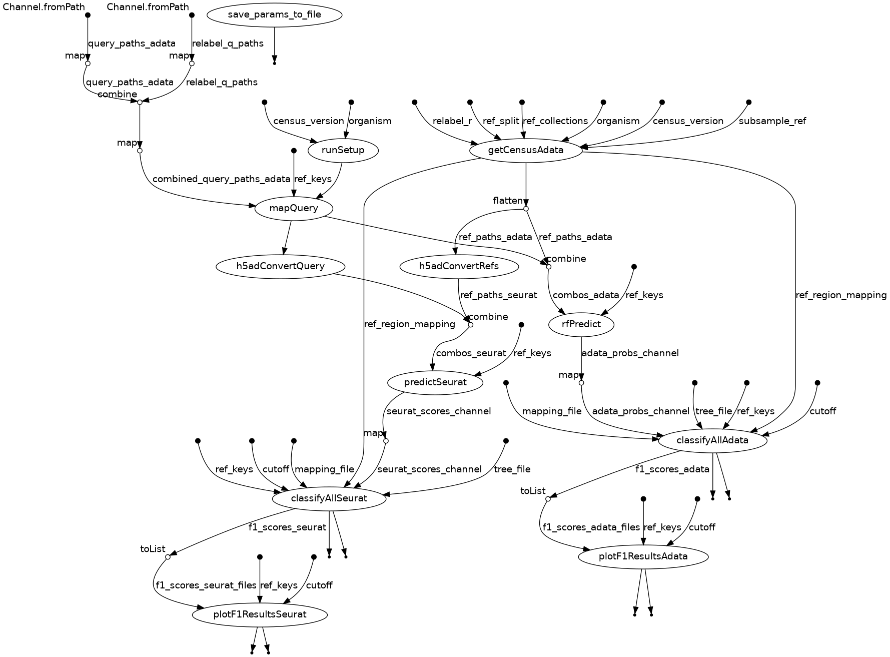

# nextflow_eval_pipeline

## Table of Contents
- [Description] (#description)
- [Features](#features)
- [Requirements](#requirements)
- [Installation](#installation)
- [Usage](#usage)
- [Input](#input)
- [Output](#output)
- [Workflow Description](#workflow_description)

---

# Description

Single-cell RNA sequencing (scRNA-seq) provides crucial insights into cell-type-specific gene expression, particularly in the context of disease. However, meta-analysis of scRNA-seq datasets remains challenging due to inconsistent and often absent cell-type annotations across publicly available repositories, such as the Gene Expression Omnibus (GEO) [cite GO]. Automated e-annotation of author cell type labels using classifiers trained on high-quality “reference”data  is a common approach to single-cell meta-analysis [cite recent paper], enabling investigators to group cell types across datasets. [Pasquini][Lotfollahi].

-explain Gemma

The selection of an appropriate classifier and related parameters is the subject of many benchmarking studies [cite benchmarking]. As there exist several widely cited single-cell datasets which are frequently used as “references” for annotation of human and mouse neocortex, benchmarking of this nature is essential to our re-annotation pipeline. Here we present an initial evaluation of two prominent cell type annotation strategies on scRNAseq human neocortex. Reference data comprises 2 studies, 10 brain regions, 12 individual dissections, and 3 levels of cell type granularity. Preliminary test data includes 6 studies comprising 3 brain regions, 7 diseases and 3 developmental stages. We assessed the impact of choice of reference, annotation method, reference subsampling, confidence filtering, and experimental factors of the test data on annotation performance.

## Methods:
A Gaussian kernel trained on Dual PCA projection of reference and query datasets using the Seurat package [cite Seurat]
A random forest classifier trained on latent embedding for reference and query data using a pre-trained single-cell variational autoencoder (scvi) model [Lopez]

## Reference data:

## Test data:

A manually curated "ground truth" reference, based on the BRAIN initiative cell type taxonomy, was used to assess model performance:

## Cell type taxonomy:

# References
Puntambekar, S., et al. "Cell-level metadata are indispensable for documenting single-cell sequencing datasets." PLoS Biol., 2021.
Pasquini, G., et al. "Automated methods for cell type annotation on scRNA-seq data." Computational and Structural Biotechnology Journal, 2021.
Lotfollahi, M., et al. "The Future of Rapid and Automated Single-Cell Data Analysis Using Reference Mapping." Cell, 2024.
Gittings, L.M., et al. "Cryptic exon detection and transcriptomic changes in C9ORF72 ALS patients." Acta Neuropathol, 2023.
Jorstad, N.L., et al. "Transcriptomic Cytoarchitecture Reveals Principles of Human Neocortex Organization." Science, 2023.
Abdulla, S., et al. "CZ CELL×GENE Discover: A Single-Cell Data Platform." bioRxiv, 2023.
Lopez, R., et al. "Deep Generative Modeling for Single-Cell Transcriptomics." Nature Methods, 2018.

