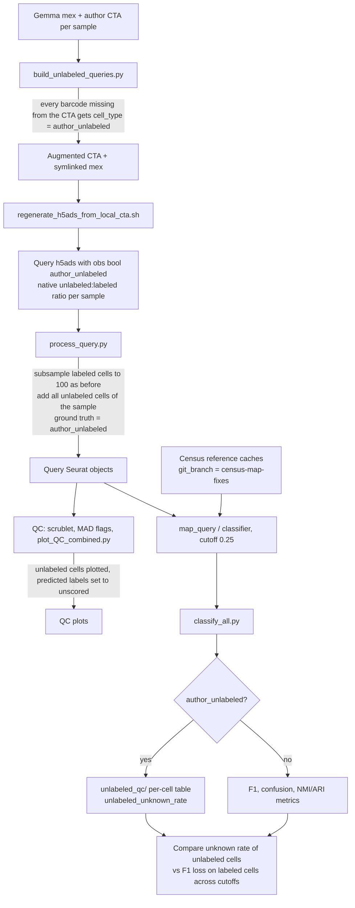

# Unlabeled-cell cutoff test: logic

Goal: test whether a classifier probability cutoff labels author-unlabeled cells "unknown" without hurting labeled cells.

Unlabeled cells never enter F1, confusion, NMI or ARI. They are scored only by the fraction called "unknown" at the cutoff.
