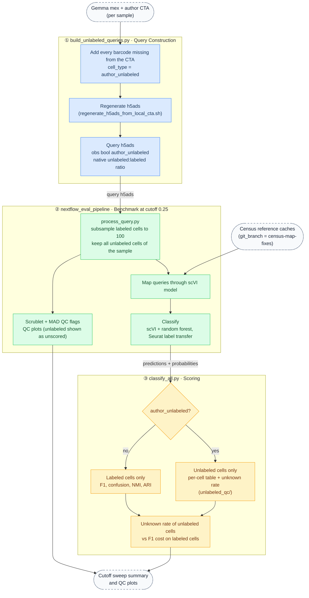

# Unlabeled-cell cutoff test: logic

Goal: test whether a classifier probability cutoff calls author-unlabeled cells "unknown" without hurting labeled cells.
Style and colors follow `worfklow-diagrams/workflow_diagram.mmd` (blue = data build, green = benchmark, amber = scoring).

Unlabeled cells never enter F1, confusion, NMI or ARI. They are scored only by the fraction called "unknown" at the cutoff.
